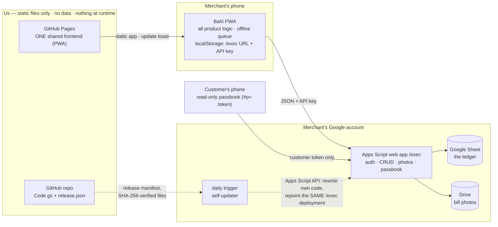

# Bahi — Architecture & Distribution Strategy

*11 Aug 2026. The load-bearing document: how code divides between frontend and backend, why, and how that division survives distribution to merchants we never meet.*

## 0 · The picture

Solid arrows are the runtime data path — note that none of them touch us. Dotted arrows are the two update channels: frontend via Pages (evergreen), backend via the self-updater (pull-based, verify-then-apply).

## 1 · The non-negotiable, and what it forces

**The merchant owns their data and their backend.** The database is their Google Sheet; the API is their Apps Script deployment, running as them, in their account, under their key. Jishant is not a service provider; there is no server of ours in the data path, ever.

This single constraint forces the whole architecture, because it splits the codebase into two planes with opposite update characteristics:

| | **Frontend** (`docs/`) | **Backend** (`apps-script/Code.gs`) |
|---|---|---|
| Runs | in the merchant's browser | in the merchant's Google account |
| Deployed by | us, centrally (GitHub Pages) | the merchant, once, by pasting |
| Update speed | **evergreen** — everyone is on latest within ~a day (update toast) | **frozen at install** — updates only when a human acts |
| Trust surface | static, open-source, re-hostable by anyone | runs with the merchant's Google grants |

**Therefore the division rule is:**

> **Everything that changes lives in the frontend. The backend is a thin, stable data plane — closer to a protocol than an app.**

Code goes into the backend only if it passes one of three tests:
1. **Security requires it server-side** — the API-key check; the passbook token gate and its field filtering (the client can never be trusted to hide fields).
2. **It needs Google-side authority** — writing the Sheet, LockService atomicity, Drive photo store/fetch/trash, id/token generation.
3. **It's schema self-care** — the backend migrates its own sheet (auto-adds missing columns) so old data files work with new code.

Everything else — balances, rendering, queue, links, reminders, compression, thumbnails, demo mode, all product behavior — is frontend, deliberately. Two reasons beyond updatability: **latency** (Apps Script round trips are 1–3s; any logic moved there is felt on every tap) and **offline** (the FE must be able to compute everything from its local cache).

### On "keeping the frontend light"

The frontend is light where it matters and should stay so: **~20KB gzipped, zero dependencies, vanilla JS**, cache-first so it opens instantly on a ₹8,000 phone. "Light" must not mean "thin client" — moving product logic into the backend would make it slower (latency), more fragile (version skew), and harder to update (merchant-owned). The FE is the smart, fast-moving half by design; we keep it *byte*-light and *dependency*-light, not *logic*-light.

## 2 · What lives where — current inventory

**Backend (Code.gs, ~420 lines) — the data plane:**
- Auth: constant API key check on every request; keyless `passbook` action gated by per-customer token
- CRUD on two sheets (`user`, `transaction`), blank-row tolerant, LockService-serialized writes
- Schema self-migration: missing columns auto-added; **columns are additive-only, forever**
- Id + token generation; photo store/fetch/trash in the merchant's own Drive (Advanced Drive Service, narrow scopes)
- Passbook: returns only `{name, transactions:[date, type, amount, comment]}` — the field filter IS the privacy boundary
- `remindLog` (stamps `last_reminded`)

**Frontend (docs/, ~1,200 lines JS) — the product:**
- All rendering, all workflows, all copy; balance math; search/sort
- Offline write queue with optimistic apply + tmp-id remapping
- Link minting/parsing (invite `#s=`, passbook `#p=` — fragments never reach any server)
- WhatsApp reminder composition; image compression; thumbnail generation & cache; demo mode; update toast; PWA shell

## 3 · The version-skew contract (the actual strategy)

Merchants **will** be on different backend versions — permanently. Even with auto-update, some fraction never updates. So skew is not an error state to eliminate; it is the normal state to engineer for. The contract:

**Rules the backend obeys (so old frontends never break):**
- B1. Actions are additive-only. Never rename, never remove, never change the meaning of an existing action or field.
- B2. Sheet columns are additive-only. The backend never depends on column order (it maps by header).
- B3. Unknown fields in a request are ignored, not rejected.
- B4. Every `list` response carries `v: <int>` (backend version) — **new in v4**, the keystone.

**Rules the frontend obeys (so old backends never break it):**
- F1. Feature-detect, never assume: each capability gates on `v` (or on the field's presence, for pre-v4 backends that report no version).
- F2. Degrade gracefully and visibly: a missing capability hides its UI or shows "backend update needed" — never a broken control. (Precedent already shipped: `{passbook}` silently drops when the backend has no tokens.)
- F3. The FE declares `MIN_BE` — the oldest backend it fully supports; older than that, it still does core CRUD but shows a persistent "update your backend" nudge in Settings.
- F4. New write-fields are only sent when `v` says the backend understands them (B3 makes accidents harmless, but don't rely on it).

This is the same contract that lets browsers talk to decade-old web servers: versioned, additive, feature-detected. It is what we "rely on for distribution": **a merchant from a two-year-old template copy must still work with today's frontend.**

### 3.5 · The contract (armed, not yet frozen)

**Freeze status: deferred.** We are pre-release — the only deployment is our own test merchant, so breaking iterations to the surface below are allowed and expected. The freeze activates at an **explicit release event declared by Jishant**; from that moment the rules in this section bind forever. Until then, treat this section as the *draft* of what we'll be promising — every change to the surface should still be weighed as "are we happy to freeze this shape?"

The asymmetry that motivates the eventual freeze: **we can fix any frontend mistake tomorrow; a backend mistake is deployed into Google accounts we can't reach.** At release, everything below becomes protocol, not code — it can be *added to*, never changed:

**Transport:** GET with query params, or POST with a `text/plain` JSON body `{action, key?, …}` (no CORS preflight — invariant). Responses may arrive via 302 redirect; clients always follow. Envelope: `{ok:true, data}` | `{ok:false, error:<string>}`. **Error *text* is explicitly NOT contract** — the frontend must never parse messages (v4 adds an additive machine-readable `code` field for that).

**Auth:** every action except `passbook` requires an exact `key` match. `passbook` is keyless, gated by the per-customer `token`.

**Actions (semantics frozen):** `list` · `addUser` · `updateUser` · `deleteUser` · `addTxn` · `updateTxn` · `deleteTxn` · `photo` · `remindLog` · `passbook`.

**Schema:** sheets named `user` and `transaction`; columns mapped by header name, never by position; the 14 existing headers are never renamed, removed, or retyped; `type` ∈ {`given`, `received`}; ids and tokens are opaque strings.

**One inversion of the additive rule:** the `passbook` response is *subtractively* frozen — it returns exactly `{name, transactions:[date, type, amount, comment]}`, and **adding** a field there is a privacy change, not a compatible change. Additions to passbook output require a deliberate privacy decision, never ride along with a schema change.

**Enforcement (not aspiration):** the E2E suite keeps one frozen mock backend per released version — the v3 mock is written once and never edited; v4 gets its own; the matrix is append-only. Every future frontend must pass its core specs against *every* mock in the matrix before shipping. A contract break becomes a red CI run, not a stranded merchant.

**Admission test for new backend surface:** before anything enters Code.gs, it must pass "would we still be willing to serve this exact semantics in 2030?" — because we will be. If the answer is "probably we'd want to tweak it", it belongs in the frontend, or it isn't ready.

## 4 · Honest map of central dependencies

"No company in the middle" is precisely true for **data and API** — those are fully the merchant's. Two soft central dependencies remain, both acceptable because they fail safe:

| Dependency | If it vanishes | Mitigation |
|---|---|---|
| GitHub Pages hosting of the FE | Installed PWAs keep running from cache; data untouched; no writes lost (queue is local) | FE is static + open source: anyone can fork and re-host; a merchant's backend works with any re-host. Invite/passbook links embed our origin — re-hosted links would differ, that's all |
| GitHub raw as the update source (if self-update ships) | Backends simply stop updating; nothing breaks | Updates are pull-based and merchant-authorized; a dead source = frozen, working backend |

There is deliberately **no runtime** central dependency: nothing a merchant does day-to-day touches infrastructure we run. (This is also why the Apps Script *library* pattern is rejected below.)

## 5 · Updating merchant backends — the options

**Option A — Assisted update (baseline, ships in v4):** no new scopes, pure decentralization.
- v4 returns `v` + its own `scriptId` (`ScriptApp.getScriptId()`) and sheet URL in `list`.
- When `v < LATEST_BE`, Settings shows: "Backend v3 → v5 available" with a one-tap flow: copy new Code.gs → open `script.google.com/d/<scriptId>/edit` directly → short Hinglish checklist for the paste + New version dance.
- Cuts today's "find the README, find your script" friction to ~2 minutes of guided pasting. Still needs a human who can paste — acceptable for the helper persona.

**Option B — Silent self-update (chosen direction, 11 Aug 2026; mechanics verified):** the backend updates itself with **zero per-update user action**.

*Mechanics — each verified against docs/working precedents:*
1. The script calls the Apps Script API **on itself** via `UrlFetchApp` + `ScriptApp.getOAuthToken()`: `projects.updateContent` (new code → HEAD), then `projects.versions.create` + `projects.deployments.update` pointing the **existing** deployment at the new version — the `/exec` URL (and every invite/passbook link) survives. Updating-not-recreating the deployment is exactly the documented pattern for keeping a web app's URL.
2. A **time-driven trigger** (installed programmatically, daily) checks a version manifest in our public repo; when a newer release exists, it fetches the pinned files and applies steps 1. No taps, no visits — updates land like the frontend's do. The FE's "Update backend" button remains as a manual "check now".
3. Rollback: Apps Script keeps every version; Manage deployments → previous version is one click, and the updater can auto-revert if a post-update self-test (`list` against itself) fails.
4. **Per-merchant state never lives in code.** Auto-update overwrites Code.gs wholesale, so anything merchant-specific — the API key, the photo folder id — lives in Script Properties, which updates can't touch. (v4 moved the API key there; the old constant remains only as a one-time migration shim.) Corollary: rotation is now a property edit, not a code edit.

*One-time setup cost (at install, not per update):* three extra OAuth scopes — `script.projects`, `script.deployments`, `script.scriptapp` (triggers) — plus flipping the **"Google Apps Script API" toggle** at script.google.com/home/usersettings (Google requires it before the API will touch the user's scripts; without it, calls 403). These land in the same consent screen the merchant already sees at setup.

*Hard limits (design around, can't remove):*
- **Scope changes can never be silent.** If a new version's manifest adds an OAuth scope, executions fail until the merchant re-consents — so releases must keep scopes stable to auto-apply; scope-adding releases are "major" and go through the assisted flow. This is a guardrail, not just a limit: pushed code can never silently expand its own permissions.
- `script.projects` is broad (all the merchant's script projects, not just Bahi). The trust story must present this honestly; decliners get Option A.

*Security design (must ship with release, since auto-update = a code-delivery channel into merchant accounts):* the update source is our public repo at pinned tags; the release manifest (version + SHA-256 of each file) is **signed**, and the verifying public key is baked into the currently-deployed script. The updater applies nothing that doesn't verify. A compromised GitHub account alone therefore can't push code to merchants — the signing key must also be lost. During development, pinned-tag + hash check suffices; signing lands at the release event.

**Option C — Shared Apps Script library (rejected).** A 10-line merchant stub delegating to our published library would centralize updates perfectly — and reintroduce exactly the dependency the product exists to avoid: every merchant's backend would **stop working** if our library account died. Central runtime dependency = not our product. (It also has deployment/version-pinning subtleties in webapps that make "instant updates" less certain than advertised.)

**Recommendation (updated 11 Aug 2026): B is the default path — build the self-updater into Code.gs v4 and spike it on our own test deployment first; A ships alongside as the fallback for merchants who decline the broader scopes; never C.** And regardless of adoption, §3's skew contract remains the safety net — silent updates shrink the version tail, they don't eliminate it.

## 6 · What this means for the near-term plan

- **Sprint 2 (bug fixes + test harness) is unchanged** — it is frontend-only by design and benefits from skew rules F1/F2 already.
- **Code.gs v4 becomes the "contract release",** batched as one redeploy: `v` + `caps` in `list` · `scriptId` + spreadsheet URL in `list` (assisted update + "open my sheet" trust feature) · `token` in the `updateUser` whitelist (passbook revoke) · optional thumbnail column. Ships when Sprint 3 (collection round) lands, so merchants redeploy once, not thrice.
- **The E2E mock backend must speak v3 AND v4** — skew becomes a tested path, not a hoped-for one: the suite runs core specs against both, which is how F1–F4 stay true forever.
- The template-sheet onboarding (backlog #10) snapshots whatever Code.gs is current; §3 guarantees old copies keep working; §5 gives them an upgrade path.
